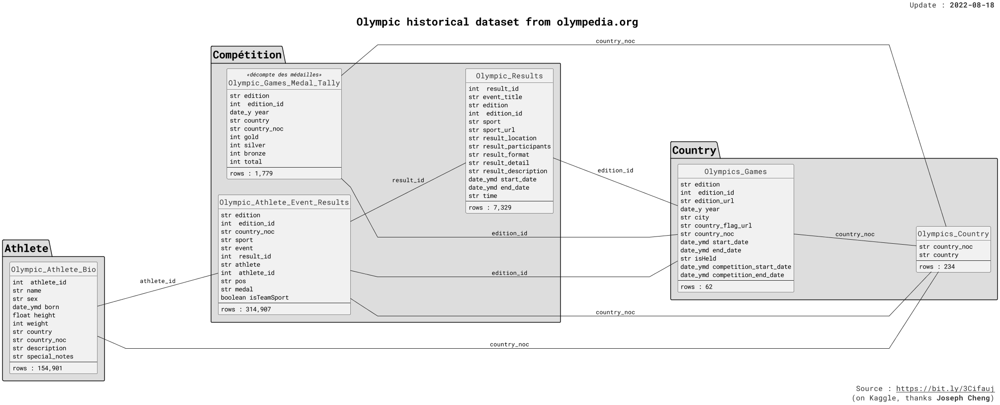

# olympic-history-dataset
Comprehensive Athlete-Level Results from Athens 1896 to Beijing 2022

About Dataset

This dataset presents a comprehensive archive of Olympic history, spanning 126 years from the first modern Olympic Games in Athens in 1896 to the Beijing Winter Olympics. It provides athlete-level results, detailed biographical information, and performance metrics, making it a valuable resource for sports analysts, data enthusiasts, researchers, and historians.
Key Features:

    Extensive Athlete Data: The dataset includes information on 154,902 unique athletes, offering a deep dive into the personal and physical characteristics of Olympians across more than a century. This data includes details such as height, weight, and date of birth, allowing for rich, data-driven storytelling and analysis.

    Comprehensive Event Coverage: Encompassing both Winter and Summer Olympic Games, the dataset covers 7,326 unique events, each with detailed rankings and performance data. The data captures the achievements of athletes in both team and individual sports, providing insights into their rankings and performance across different rounds and heats.

    Global Representation: The dataset features information from 235 distinct countries, including those that no longer exist. This extensive country-level data offers a global perspective on Olympic participation and success, highlighting the diversity and reach of the Olympic Games.

Usage and Applications:

    Performance Analysis: With detailed rankings and athlete biographies, this dataset is ideal for analyzing performance trends over time. Users can identify patterns, compare athlete performance across different eras, and explore the factors that contribute to Olympic success.

    Data Integration and Feature Extraction: The dataset is designed for easy integration and feature extraction. By merging athlete and event data, users can create comprehensive profiles of athlete participation, calculate BMI, and determine the age of athletes during their Olympic performances.

    Research and Visualization: Whether you’re conducting research on Olympic history or creating visualizations to explore trends, this dataset provides a solid foundation. It is perfect for generating insights into the evolution of the Olympics, the impact of different countries, and the progression of sporting events.

Data Source and Validation:

The data is sourced from Olympedia.org, a well-respected repository of Olympic history maintained by a dedicated community of Olympic historians and statisticians. The dataset has been validated through careful comparison with official Olympic records, including medal tallies, to ensure accuracy. It is up-to-date, providing a reliable resource for exploring Olympic data across the entire history of the Games.
Schema:

For a visual overview of the dataset’s structure, please refer to the data schema below:

This schema outlines the relationships between different tables and fields within the dataset, helping users understand how to navigate and utilize the data effectively.
